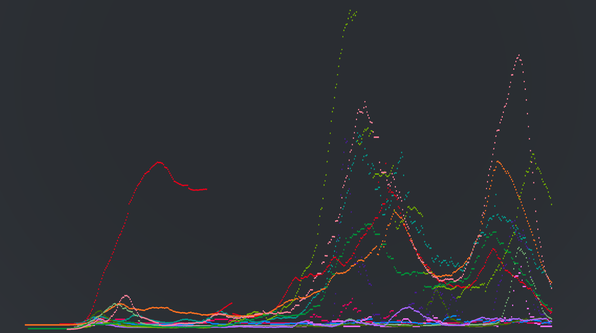
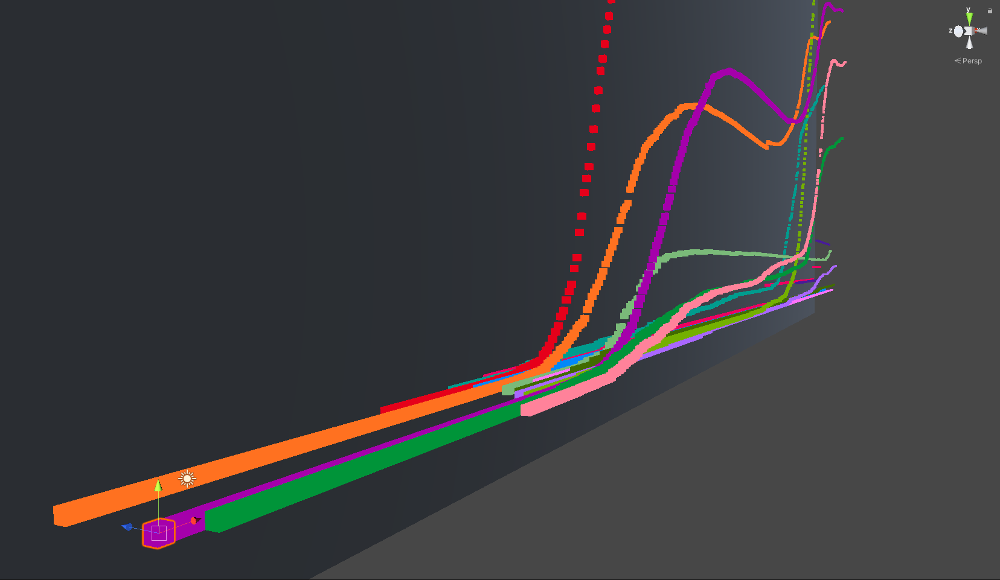
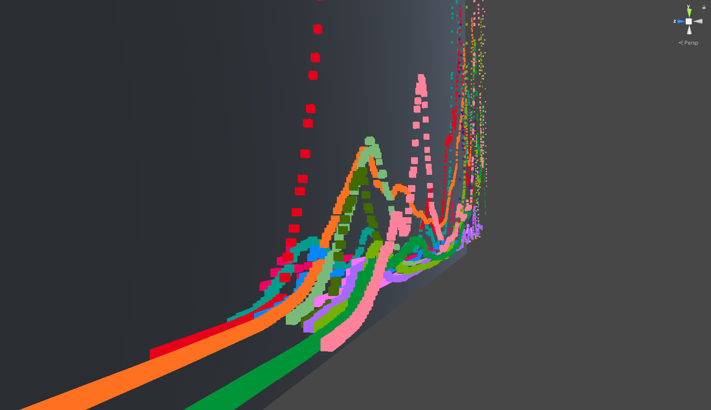
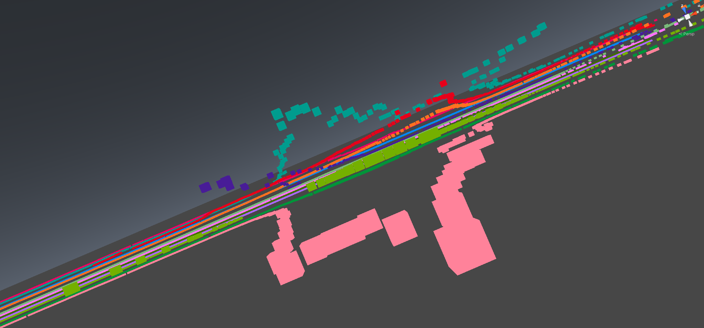

# Covid Graphing

A project to plot covid-19 data from Canada in Unity 2019... because reasons. A WebGL interface is the next step, as this currently only runs in the Unity editor. This will be a learning project to create a multi-platform interface, and maybe something interesting to visualize the data.

Downloads data set from my other project:
[canada.covid19](https://esklarski.github.io/canada.covid19/)

## Plans:
(maybe)
- WebGL interface
- logarithmic plotting too
- performance improvements (it's pretty bad right now)
- overlay of notable events
- click data point to get more info
- options to exclude provinces (not just Canada)
- etc

## Screenshots:
Active Cases by Province normalized by population.

Editor View

